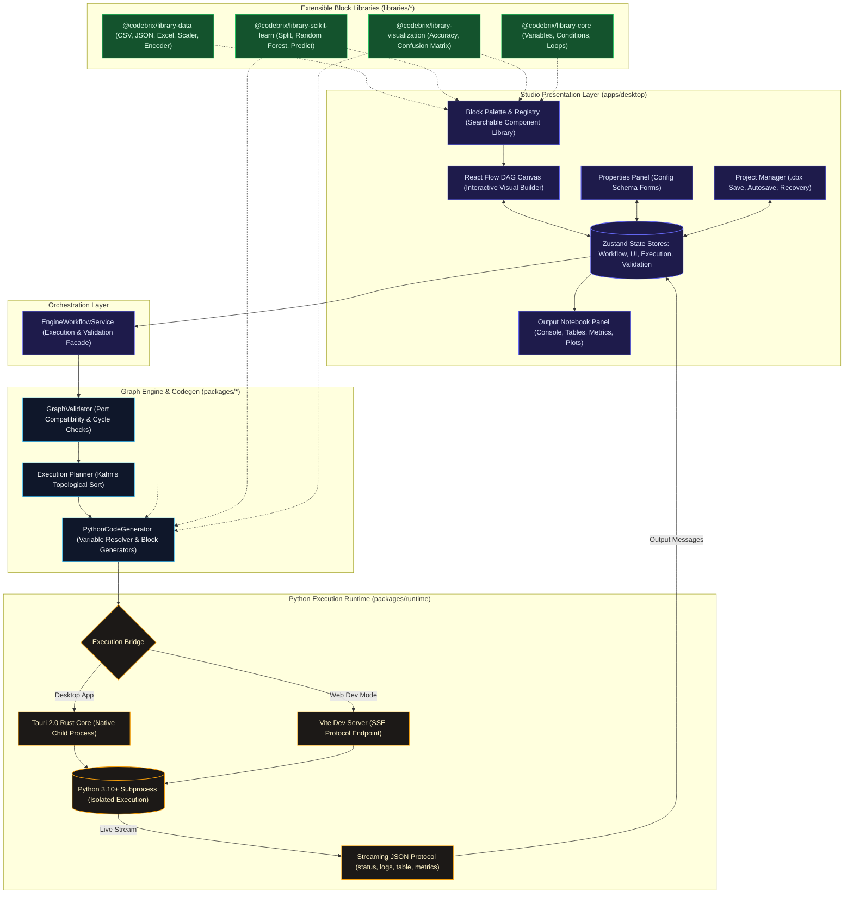

<div align="center">

# 🧱 CodeBrix

**An open-source, extensible visual programming platform for Machine Learning.**

Build ML pipelines with drag-and-drop ease, inspect real-time notebook outputs, and generate clean, standalone, zero-lock-in Python scripts.

[](https://github.com/Mayank3613/CodeBrix/actions)
[](LICENSE)
[](https://www.typescriptlang.org/)
[](https://www.python.org/)
[](https://tauri.app/)
[](https://react.dev/)

</div>

---

## 🌟 Vision & Overview

CodeBrix bridges the gap between visual flowchart modeling and production-grade Python data science. Rather than hiding the code behind proprietary abstractions or lock-in runtimes, CodeBrix operates as a visual compiler:

1. **Visual Workflow DAG:** Interactively build directed acyclic graphs (DAGs) on an infinite, type-checked canvas.
2. **Deterministic Code Generation:** Transform visual blocks into PEP-8 compliant Python scripts using scikit-learn, pandas, and numpy.
3. **Isolated Process Execution:** Run Python pipelines in separate, monitored subprocesses with bidirectional, real-time JSON protocol streaming.
4. **Interactive Notebook Output:** View streaming console logs, auto-paginated dataset previews, evaluation metric cards, and confusion matrices in a draggable, resizable notebook panel.
5. **Universal Project Portability:** Save, load, and restore `.cbx` project files losslessly, or export standalone `.py` scripts ready to run anywhere.

---

## 🏗️ Architecture & Monorepo Layout

### System Architecture Diagram



### Monorepo Structure

CodeBrix is architected as a high-performance monorepo managed via `pnpm` workspaces:

```text
CodeBrix/
├── apps/
│   └── desktop/               # Tauri 2.0 + React 19 desktop application
│       ├── src/
│       │   ├── canvas/        # React Flow DAG canvas with port validation
│       │   ├── palette/       # Searchable block catalogue palette
│       │   ├── panels/        # Properties, Validation, and Output Notebook panels
│       │   ├── project/       # .cbx project serialization, autosave & file I/O
│       │   ├── registry/      # Dynamic block catalogue & library loader
│       │   ├── services/      # EngineWorkflowService, Tauri & SSE Python runtime
│       │   └── stores/        # Zustand state stores (workflow, ui, validation, execution)
│       └── src-tauri/         # Rust backend, native windowing & process management
├── packages/
│   ├── types/                 # Shared data contracts (WorkflowGraph, Port, OutputMessage)
│   ├── shared/                # Universal guards, JSON protocol parsers, constants & mocks
│   ├── graph-engine/          # Port validator, cycle detection & Kahn's topological planner
│   ├── codegen/               # AST variable resolver & block Python code generators
│   └── runtime/               # Cross-platform Python discovery & subprocess process manager
├── libraries/
│   ├── core/                  # Core control blocks (Variables, Conditions, Loops, Functions)
│   ├── data/                  # Tabular data blocks (CSV, JSON, Excel, Scaler, Encoder)
│   ├── scikit-learn/          # ML modeling blocks (Split, Random Forest, Predict, Accuracy)
│   └── visualization/         # Diagnostic visualizer blocks (Confusion Matrix, Plots)
├── tests/
│   ├── fixtures/              # Acceptance fixtures (iris.csv)
│   ├── spikes/                # Process spikes & protocol verification
│   └── integration/           # End-to-end integration test suites (Gates 1-5)
├── python/                    # Python runner scripts & dependencies
└── scripts/                   # Canonical Iris acceptance scripts (validate, generate, run)
```

---

## 👥 Two-Developer Vertical Ownership Model

CodeBrix is developed using a strict vertical ownership model to ensure clean architectural boundaries, zero merge conflicts, and clear module stewardship:

| Domain | Owner | Scope & Packages |
|---|---|---|
| **Data & Workflow** | Developer 1 (`@Mayank3613`) | `apps/desktop/` (UI, Canvas, Palette, Properties, Output Container, Stores, Services), `libraries/core/`, `libraries/data/`, Project System (`.cbx`, Autosave, Recovery), `pnpm-workspace.yaml`, Root Configs |
| **ML & Execution** | Developer 2 (`@Arshit-dv`) | `packages/graph-engine/`, `packages/codegen/`, `packages/runtime/`, `libraries/scikit-learn/`, `libraries/visualization/`, `apps/desktop/.../renderers/`, `python/`, Test Runners, CI/Vitest Config |
| **Shared Contracts** | Both | `packages/types/`, `packages/shared/`, `tests/integration/`, `.github/workflows/ci.yml` |

---

## 📅 Phase-Wise Implementation Roadmap & Status

Based on the **CodeBrix Phase-wise Workflow & Working Plan**:

| Phase | Focus | Milestones & Exit Gates | Status |
|:---:|:---|:---|:---:|
| **Phase 0** | **Shared Foundation** | • Monorepo skeleton, shared TypeScript config, Vitest & ESLint.<br>• Core contracts frozen (`v0.1.0` in `@codebrix/types`).<br>• Python subprocess execution spike & streaming JSON protocol. | ✅ Complete |
| **Phase 1** | **Canvas & Graph Engine** | • App layout, React Flow canvas, node rendering, Zustand stores.<br>• Graph validator, port type contracts, cycle detection, topological sort.<br>• **Gate 1:** Real validator runs on canvas-built graph; error highlighting. | ✅ Complete |
| **Phase 2** | **Blocks, Project Files & Codegen** | • Schema-driven properties panel, visual connection feedback.<br>• `.cbx` project file format (New/Open/Save/Save As).<br>• Code generation IR, variable resolver, and Scikit-Learn block generators.<br>• **Gates 2 & 3:** Topological plan and lossless `.cbx`-to-Python code generation. | ✅ Complete |
| **Phase 3** | **Libraries & Python Runtime** | • Dynamic block discovery, project autosave & crash recovery.<br>• Cross-platform Python discovery (`venv`, `py`, `python`, `python3`).<br>• Process manager with streaming stdout/stderr protocol & structured errors. | ✅ Complete |
| **Phase 4** | **Workflow UX & Output Engine** | • Run/Stop toolbar, per-block execution status glow.<br>• Draggable vertical top resize handle with maximize/restore toggle.<br>• Modular output renderers: Console with tracebacks, Tables, Metrics, Plots.<br>• **Gate:** Canonical Iris classification renders all live outputs in real time. | ✅ Complete |
| **Phase 5** | **Full Integration** | • Combined `data-workflow` & `ml-execution` branches into `main`.<br>• Robustness on arbitrary datasets (quote stripping, text auto-encoding, regression fallback).<br>• **Gate 4:** Full 8-block merged pipeline passes all unit and integration tests. | ✅ Complete |
| **Phase 6** | **Cross-Platform Validation** | • Windows, macOS, and Linux multi-OS validation.<br>• Path separator normalization, line-ending hygiene, native packaging.<br>• Cross-platform .cbx portability with spaces/non-ASCII paths.<br>• **Gate:** Multi-OS CI matrix, .cbx round-trip tests, native packaging & Python path handling. | ✅ Complete |
| **Phase 7** | **MVP Release & Polish** | • End-to-end stress testing, user documentation polish, and `v0.1.0-mvp` release. | ⏳ Planned |

---

## 🚀 Quickstart & Installation

### Prerequisites

- **Node.js:** `v18.0.0` or higher
- **pnpm:** `v9.0.0` or higher (`corepack enable && corepack prepare pnpm@latest --activate`)
- **Python:** `3.10` or higher (with `venv` support)
- **Rust & Cargo:** (Optional, only required for compiling native Tauri desktop binaries)

### 1. Clone & Setup Workspace

```bash
git clone https://github.com/Mayank3613/CodeBrix.git
cd CodeBrix

# Run automated setup (installs pnpm workspaces, sets up Python virtualenv & dependencies)
pnpm setup
```

Alternatively, configure manually:
```bash
pnpm install
python -m venv .venv
# Windows:
.venv\Scripts\pip install -r python/requirements.txt
# macOS/Linux:
.venv/bin/pip install -r python/requirements.txt
```

### 2. Launch Development Environment

#### Browser Web Dev Mode (Fastest frontend iteration with Vite SSE runner):
```bash
pnpm dev:web
```
*Open [http://localhost:1420](http://localhost:1420) in your browser.*

#### Native Desktop Dev Mode (Tauri 2.0 Rust + Webview):
```bash
pnpm dev
```

---

## 🧪 Testing & Verification

CodeBrix maintains an extensive test suite across packages, libraries, UI, and integration layers:

```bash
# Run all 48 test suites across the monorepo
pnpm test

# Run tests in interactive watch mode
pnpm test:watch

# Run TypeScript typecheck across all workspaces
pnpm typecheck

# Run linter
pnpm lint

# Run cross-platform path & .cbx portability tests (Phase 6)
pnpm test:cross-platform

# Execute complete continuous integration (CI) suite
pnpm run ci
```

### Canonical Iris Acceptance Test Scripts

Verify the acceptance pipeline through standalone CLI scripts:

```bash
# 1. Validate the canonical Iris DAG structure
pnpm validate:iris

# 2. Compile visual graph to standalone Python code
pnpm generate:iris

# 3. Execute generated Python pipeline in a live subprocess and inspect JSON protocol
pnpm run:iris
```

---

## 🧩 Supported Block Catalogue

| Category | Block | ID | Description |
|---|---|---|---|
| **Data** | CSV Loader | `data.csv_loader` | Auto-detects delimiters (`sep=None`), strips quotes, handles encodings (UTF-8, Latin-1), and emits dynamic table previews. |
| **Data** | JSON Loader | `data.json_loader` | Ingests JSON files into pandas DataFrames supporting records, split, index, and columns formats. |
| **Data** | Excel Loader | `data.excel_loader` | Reads Excel spreadsheets (`.xlsx`, `.xls`) with configurable sheet names and header rows. |
| **Preprocessing** | Feature Scaler | `data.scaler` | Normalizes numerical columns using `StandardScaler`, `MinMaxScaler`, or `RobustScaler`. |
| **Preprocessing** | Categorical Encoder | `data.encoder` | Converts text/categorical columns using One-Hot (`pd.get_dummies`), Label, or Ordinal encoding. |
| **Preprocessing** | Train/Test Split | `ml.train_test_split` | Splits datasets with configurable test ratios, auto-encodes text columns, and isolates targets. |
| **Machine Learning** | Random Forest | `ml.random_forest_classifier` | Dynamic ensemble modeling; auto-switches between Classifier and Regressor via `type_of_target`. |
| **Machine Learning** | Model Predictor | `ml.predict` | Generates inferences on test features with automatic feature-column alignment (`reindex`). |
| **Evaluation** | Accuracy Score | `eval.accuracy` | Evaluates accuracy with continuous target fallback to $R^2$ score and sample error counters. |
| **Visualization** | Confusion Matrix | `eval.confusion_matrix` | Computes live multiclass confusion matrices with diagonal highlight cards and quantile binning fallback. |

---

## 💾 Project Persistence & Python Export

- **Native `.cbx` Project Files:** Workflows are serialized as portable JSON files containing the graph DAG, port connections, block parameters, and canvas viewport coordinates.
- **Autosave & Crash Recovery:** Sessions automatically snapshot in the background. If the app closes unexpectedly, a crash recovery banner offers instant session restoration.
- **Zero-Lock-In Python Export:** Click **Export .py** in the toolbar to generate a standalone, clean script that runs with standard `python script.py` without requiring CodeBrix.

---

## 🤝 Contributing

CodeBrix is an open-source initiative. Contributions, feedback, and custom block libraries are welcome!

1. Fork the repository.
2. Create a short-lived feature branch (`git checkout -b feature/my-new-block`).
3. Ensure all tests and linting pass (`pnpm ci`).
4. Submit a Pull Request.

Please review our [Branching & Collaboration Guide](docs/workflow/branching-and-collaboration.md) for details on code ownership and review processes.

---

## 📄 License

This project is licensed under the **MIT License** — see the [LICENSE](LICENSE) file for details.